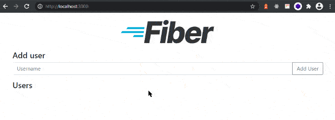

# GoFiber Docker Boilerplate


[](https://gofiber.io/discord)


## Development

### Add File .env 

Copy file from .env.example to create .env for your local work 

### Start the application from docker

```bash
cd build
docker-compose build --no-cache 
docker-compose up
docker run -d -p 3000:3000 gofiber
```

### Start the application from local

```bash
go run main.go
```

## Production

Not yet configuration



## Feature

Feature planning to embed for this boilerplate
- DDD(Domain Driven Design) architecture (complete)
- Auto Migration Db
- Jwt Auth Basic
- Request Validation (complete)
- Redis/Elastic Cache
- Logging System(With DB)
- Unit Testing
- Role Management
- Default Error Handler And Custom Error Handler